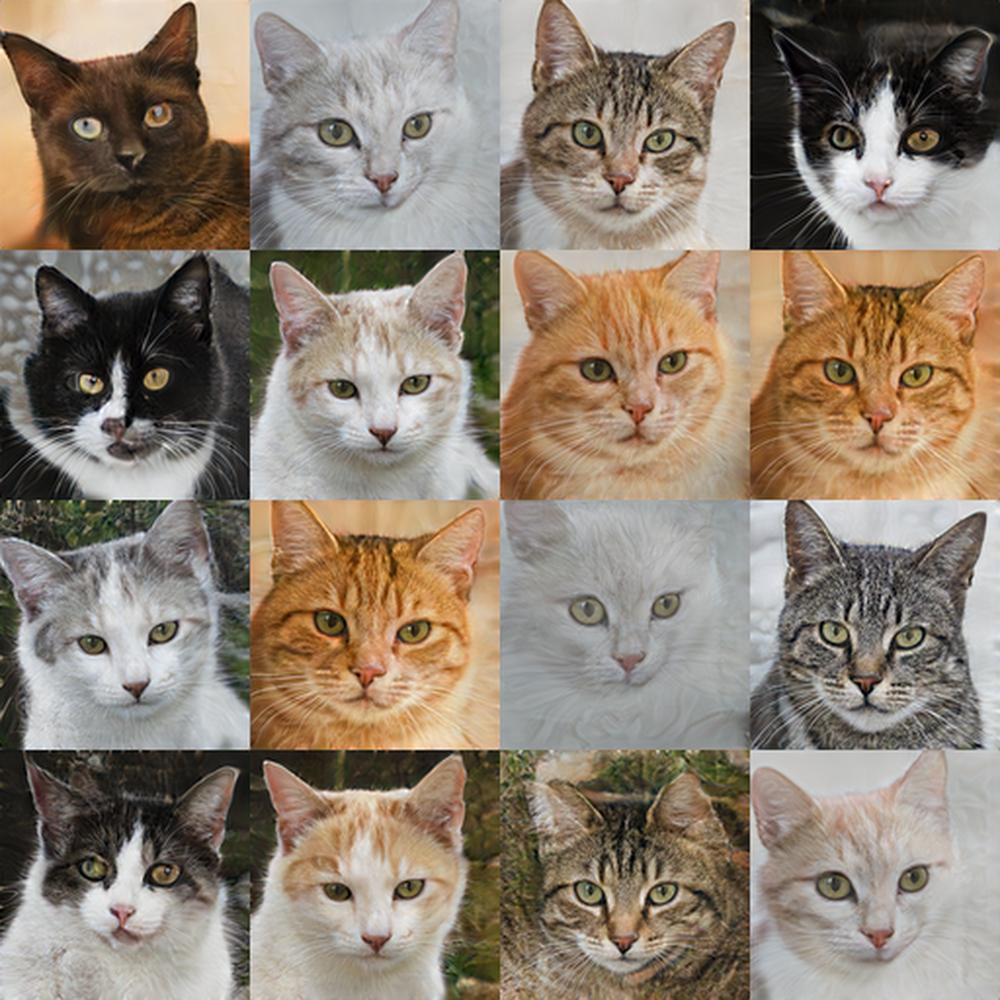
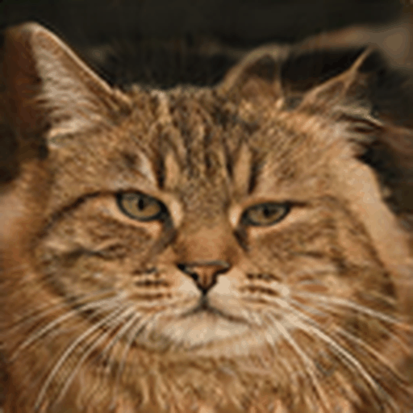
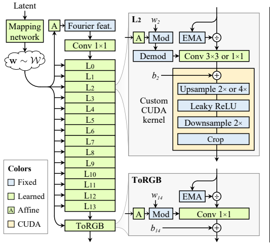

# sg3x

A complete StyleGAN3-T implementation built from scratch in JAX, Flax NNX, and Optax. Trained on cat faces.



*128x128 native resolution, upscaled to 512x512 for display*



*Slerp interpolation in W space between random latent vectors*

Full writeup covering the signal processing theory, the JAX implementation, and everything that broke along the way: [sg3x: Implementing Alias-Free GANs from Scratch in JAX](blog link)

## what is this

A from scratch implementation of Alias-Free Generative Adversarial Networks (Karras et al., 2021) in JAX, Flax NNX, and Optax. The full system, the alias-free generator with Fourier features and filtered nonlinearities, the residual discriminator with minibatch standard deviation, the adaptive discriminator augmentation pipeline, lazy R1 regularization, EMA weight averaging, and the training loop that ties it all together.

StyleGAN3 redesigns the generator to eliminate texture sticking, the artifact where generated textures stay glued to pixel coordinates instead of moving naturally with the object across frames. The paper treats every feature map as discrete samples from an underlying continuous signal and makes sure every operation respects that. The synthesis network replaces the learned 4x4 constant from StyleGAN2 with Fourier features that define a spatially infinite coordinate system not tied to any pixel grid. Per-pixel noise inputs from StyleGAN1 and StyleGAN2 are removed entirely. Every activation goes through a filtered nonlinearity pipeline that upsamples, applies a Kaiser windowed lowpass filter, activates with leaky ReLU, applies another lowpass filter, and downsamples. This prevents aliasing from creeping into the signal at any layer.

The discriminator is a residual architecture from StyleGAN2 with minibatch standard deviation, built from scratch with strided convolutions and leaky ReLU. The augmentation pipeline implements geometric transforms, color augmentations, and cutout with adaptive probability scheduling that monitors discriminator overfitting in real time. R1 gradient penalty is computed on unaugmented real images with per-sample gradient norms. EMA weights are maintained on the generator and swapped in during sample generation. The training loop handles all of this together with mixed precision, 8-chip TPU sharding, AOT compilation, and checkpoint management.

## architecture



*Figure from Karras et al. (2021). sg3x implements this full pipeline.*

The generator has 11 synthesis layers with Fourier feature input at initial resolution 16x16 and a channel schedule from 512 down to 256. The mapping network is 2 layers projecting z to w space, both 512 dimensional. Every synthesis layer uses style modulated convolutions with weight demodulation and EMA variance normalization to keep activation magnitudes stable during training. No path length regularization, no mixing regularization, no skip connections.

The lowpass filters are designed per layer using scipy.signal.firwin with Kaiser windows. The cutoff frequency, transition band width, and number of taps are all computed automatically from the equations in Section 3 of the paper. None of these are hyperparameters you tune. The filters are applied as separable 1D depthwise convolutions using feature_group_count=C, which is what activates the TPU MXU for hardware acceleration. My original implementation bypassed the MXU entirely by flattening batch and channel dimensions together, running at 0.18 steps per second. Switching to grouped depthwise convolutions jumped it to 0.48 steps per second. Same math, completely different hardware utilization.

Config: z_dim=512, w_dim=512, channels=512 to 256, synthesis layers=11, batch=32, g_lr=0.0025, d_lr=0.002, r1_gamma=0.5, r1_interval=16, ada_target=0.6, ada_kimg=500, ema_decay=0.999

Training uses bfloat16 activations with float32 weights and float32 loss computation. Lazy R1 regularization every 16 steps. Adaptive discriminator augmentation to prevent D from memorizing the dataset. NVIDIA trained on 140,000 images where the discriminator never runs out of new data to learn from. On 2000 images without ADA the discriminator memorizes everything within 1000 steps and the generator stops learning entirely.

## results

Trained on 2000 AFHQv2 cat images at 128x128 with horizontal flips on a TPU v5e-8 for approximately 46,000 steps, roughly 1488 kimg, across about three weeks of sessions. FID score of 31.22 computed on 2000 generated samples against the real dataset using clean-fid.

The model learned distinct breed variations with visible fur textures, coherent eye structure with proper pupil coloring, and natural background diversity. The latent walk shows smooth transitions between completely different cat identities in W space with no frame artifacts or discontinuous jumps. The features move with the content, not the pixel grid. That is the whole point of StyleGAN3.

Training on a dataset this small is genuinely difficult. The discriminator can memorize 2000 images in about 1000 steps if nothing stops it, and once it does the generator receives near zero gradient signal. Adaptive discriminator augmentation is what makes this possible. It monitors discriminator confidence on real images and dynamically increases augmentation probability when D starts overfitting. Without it, training on 2000 images does not work at all.

## what is built from scratch

The full generator and discriminator architecture, the training loop, and every supporting component. Fourier feature generation, Kaiser windowed lowpass filter design, filtered nonlinearity with fused downsample, style modulated convolutions with weight demodulation, EMA variance normalization, mapping network, synthesis layers, ToRGB, residual discriminator blocks, minibatch standard deviation, adaptive discriminator augmentation with geometric and color transforms and cutout, lazy R1 gradient penalty on unaugmented reals, exponential moving average of generator weights with swap and restore during sampling, checkpoint saving and loading, and sample generation with LANCZOS upscaling.

## implementation notes

Config-T only, no rotation equivariance. The lowpass filters use scipy.signal.firwin with Kaiser windows applied as separable 1D depthwise convolutions. NVIDIA uses custom fused CUDA kernels for the same operation. All training was done in bfloat16 on TPU with 8-chip sharding, whereas NVIDIA's reference code targets float32 on NVIDIA GPUs with their own upfirdn2d CUDA kernel. 128x128 resolution on 2000 AFHQv2 cat images, compared to NVIDIA's 256 and 1024 runs on the full 140,000 image dataset.

## project structure

```
.
├── assets/
│   ├── architecture.png
│   ├── hero_grid.png
│   └── latent_walk.gif
├── configs/
│   └── default.yml                 # full training config
├── scripts/
│   └── train.py                    # training loop with R1, ADA, EMA, checkpointing
├── src/
│   ├── ops.py                      # kaiser filters, filtered nonlinearity, modulated conv, fourier features
│   ├── generator.py                # MappingNetwork, SynthesisLayer, ToRGB, Generator
│   ├── discriminator.py            # DiscriminatorBlock, Discriminator with minibatch stddev
│   ├── augment.py                  # ADA augmentation pipeline
│   └── utils.py                    # EMA update, checkpoint save and load, sample generation
├── outputs/
└── requirements.txt
```

## dependencies

JAX, Flax NNX, Optax, NumPy, SciPy, PyYAML, PIL

```
pip install jax[tpu] flax optax numpy scipy pyyaml pillow
```

Designed for TPU v5e-8. Runs on GPU with minor sharding changes.

## references

Karras, T., Aittala, M., Laine, S., Harkonen, E., Hellsten, J., Lehtinen, J., & Aila, T. (2021). Alias-Free Generative Adversarial Networks. NeurIPS.

Karras, T., Laine, S., Aittala, M., Hellsten, J., Lehtinen, J., & Aila, T. (2020). Training Generative Adversarial Networks with Limited Data. NeurIPS.

Karras, T., Laine, S., Aittala, M., Hellsten, J., Lehtinen, J., & Aila, T. (2020). Analyzing and Improving the Image Quality of StyleGAN. CVPR.

## license

MIT
